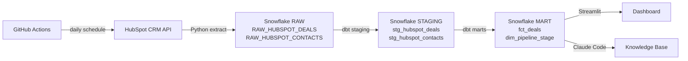

# Sales Operations Analyst — HPE Enterprise Tech

End-to-end sales analytics pipeline for a Business Analyst, Sales Operations role at Hewlett Packard Enterprise. Built to demonstrate pipeline engineering, data modeling, and analytical skills relevant to the position.

## Business Problem

HPE's sales team tracks deals in HubSpot CRM but has no analytics layer to answer questions like: Which pipeline stages have the highest drop-off? What is our average deal velocity? What does our revenue forecast look like? This project extracts that CRM data, transforms it into a clean star schema, and surfaces insights through an interactive dashboard.

## Tech Stack

| Layer | Tool |
|---|---|
| Source | HubSpot CRM API |
| Extraction | Python (`extract/hubspot_extract.py`) |
| Raw Storage | Snowflake (`SALES_OPS.RAW`) |
| Transformation | dbt (`SALES_OPS.STAGING` → `SALES_OPS.MART`) |
| Orchestration | GitHub Actions (daily schedule) |
| Dashboard | Streamlit (coming in Milestone 02) |

## Pipeline Diagram



## Star Schema

| Table | Type | Description |
|---|---|---|
| `fct_deals` | Fact | One row per deal — amount, stage, close date, days to close, deal status |
| `dim_pipeline_stage` | Dimension | Stage names, order, and terminal stage flag |
| `stg_hubspot_deals` | Staging | Cleaned and typed deals from RAW |
| `stg_hubspot_contacts` | Staging | Cleaned and typed contacts from RAW |

## Project Setup

### Prerequisites
- Python 3.11+
- Snowflake trial account (AWS US East 1)
- HubSpot developer account with private app token
- dbt-snowflake

### Installation

```bash
git clone https://github.com/mdaddio11-sketch/sales-operations-analyst-tech.git
cd sales-operations-analyst-tech
pip install -r requirements.txt
```

### Environment Variables

Copy `.env.example` to `.env` and fill in your credentials:

```bash
cp .env.example .env
```

### Run the Pipeline

```bash
# Extract from HubSpot and load to Snowflake RAW
python extract/hubspot_extract.py

# Transform with dbt
dbt run --project-dir sales_ops
dbt test --project-dir sales_ops
```

## Repository Structure

```
sales-operations-analyst-tech/
├── Docs/
│   ├── job-posting.pdf
│   └── proposal.md
├── extract/
│   └── hubspot_extract.py
├── sales_ops/
│   └── models/
│       ├── staging/
│       │   ├── stg_hubspot_deals.sql
│       │   ├── stg_hubspot_contacts.sql
│       │   └── schema.yml
│       └── marts/
│           ├── fct_deals.sql
│           └── dim_pipeline_stage.sql
├── .github/
│   └── workflows/
│       └── pipeline.yml
├── .env.example
├── requirements.txt
└── README.md
```

## Target Role

**Business Analyst, Sales Operations — Hewlett Packard Enterprise**

This project directly mirrors the responsibilities in the job posting: SQL-based data analysis, pipeline automation, dashboard development, and cross-functional data enablement for a sales organization.