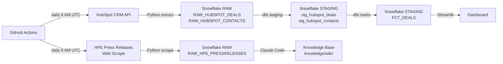

# HPE Sales Operations Analytics

End-to-end sales operations analytics pipeline built as a portfolio project for the Business Analyst, Sales Operations role at Hewlett Packard Enterprise. Extracts deal pipeline data from the HubSpot CRM API and HPE press release content via web scrape, transforms it through Snowflake and dbt, and surfaces pipeline health and revenue forecast analytics in a deployed Streamlit dashboard.

## Job Posting

- **Role:** Business Analyst, Sales Operations
- **Company:** Hewlett Packard Enterprise (HPE)
- **Reference:** `Docs/job-posting.pdf`

This project directly mirrors the HPE Sales Ops role: SQL-based pipeline analysis, automated data pipelines, interactive dashboard development, and company research via a queryable knowledge base.

## Live Dashboard

**URL:** https://sales-operations-analyst-tech-7trecnk33sod5z6kdradoc.streamlit.app

Data syncs from HubSpot daily at 6 AM UTC via GitHub Actions. The dashboard cache refreshes every 24 hours automatically.

## Tech Stack

| Layer | Tool |
|---|---|
| Source 1 | HubSpot CRM API (deals, contacts) |
| Source 2 | HPE Press Releases (web scrape) |
| Data Warehouse | Snowflake (RAW → STAGING) |
| Transformation | dbt (staging models + FCT_DEALS mart) |
| Orchestration | GitHub Actions (daily at 6 AM UTC) |
| Dashboard | Streamlit (deployed to Community Cloud) |
| Knowledge Base | Claude Code (15 sources → 3 wiki pages) |

## Pipeline Diagram



## Dashboard Sections

### 1. Pipeline Overview
Five metric cards filtered by sidebar selections (Sales Team, Opportunity Owner, Fiscal Period):

| Metric | Definition |
|---|---|
| Total Deals | COUNT of all deals matching current filters |
| Closed Won Revenue | SUM(DEAL_AMOUNT) where ORIGINAL_STAGE = 'Closed Won' |
| Win Rate | COUNT(Closed Won) / COUNT(Closed Won + Closed Lost + Gone Cold) |
| Open Pipeline Value | SUM(DEAL_AMOUNT) where stage is not closed |
| Weighted Open Pipeline | SUM(DEAL_AMOUNT × STAGE_PROBABILITY) for open deals only |

The gap between Open Pipeline Value and Weighted Open Pipeline shows how much risk is embedded in the current pipeline — a large gap means deals are concentrated in early, low-probability stages.

### 2. Target vs Actuals
- **Team chart**: horizontal overlay bar (actual vs target) with a summary table showing each team's actual revenue, target, and % attained — color-coded green/red at the 50% threshold
- **Rep leaderboard**: all reps sorted by closed won revenue with a progress bar showing % of individual target; clicking any rep opens a popover with all their deals, stage status, and green row highlighting for Closed Won

### 3. Pipeline Health
- **Stage group chart**: stacked bar by sales team using 4 groups — Early Stage, Late Stage, Closed Won, Lost / Gone Cold — with consistent color coding (blue, amber, green, red)
- **Open Pipeline by Stage**: horizontal bar chart with per-stage urgency coloring (darkest = closest to close) and deal count in hover tooltip
- Expander explains what high volume in each stage group signals about pipeline health

### 4. Revenue Forecast
- **Expected Revenue by Stage**: probability-weighted revenue per stage, sorted high-to-low with dark-to-light blue gradient
- **Booked Revenue**: closed won revenue locked in
- **Likely Case**: probability-weighted open pipeline — the expected additional revenue if open deals close at their current stage probability
- Expander explains the probability-weighting methodology with concrete dollar examples

### 5. Raw Deal Data
Collapsible table showing all deals with owner, account, stage, team, amount, close date, and fiscal period.

## ERD

See [Docs/erd.md](Docs/erd.md) for full column definitions.

```
FCT_DEALS
─────────────────────────
DEAL_ID (PK)
DEAL_NAME
ACCOUNT_NAME
OPPORTUNITY_OWNER
SALES_TEAM
DEAL_AMOUNT
ORIGINAL_STAGE
STAGE_PROBABILITY
CLOSE_DATE
CLOSE_MONTH
FISCAL_PERIOD
```

## Stage Probability Model

Each CRM stage is assigned a fixed close probability:

| Stage | Probability |
|---|---|
| Closed Won | 1.0 |
| Expected Close | 0.9 |
| Verbal Confirmation | 0.8 |
| Proposal / Quote | 0.6 |
| Priority | 0.6 |
| Qualified | 0.4 |
| Backlog | 0.2 |
| Closed Lost | 0.0 |
| Gone Cold | 0.0 |

## Knowledge Base

A Claude Code-curated wiki built from 15 scraped sources about HPE. Wiki pages live in `knowledge/wiki/`, raw sources in `knowledge/raw/`.

**Query it:** Open Claude Code in this repo and ask questions like:
- What is HPE's AI strategy and how does the Juniper acquisition fit in?
- What does HPE's go-to-market look like across Enterprise, Public Sector, and SMB?
- Who are HPE's main competitors and how does HPE differentiate?

## Setup & Reproduction

**Prerequisites:** Python 3.11+, Snowflake account (AWS US East 1), HubSpot developer account with private app token, dbt-snowflake

Copy `.env.example` to `.env` and fill in:

```
SNOWFLAKE_ACCOUNT=
SNOWFLAKE_USER=
SNOWFLAKE_PASSWORD=
SNOWFLAKE_DATABASE=
SNOWFLAKE_WAREHOUSE=
HUBSPOT_TOKEN=
```

Run the pipeline:

```bash
# Extract from HubSpot → Snowflake RAW
python extract/hubspot_extract.py

# Scrape HPE press releases → Snowflake RAW
python extract/hpe_scrape.py

# Transform with dbt
dbt run --project-dir sales_ops
dbt test --project-dir sales_ops

# Launch dashboard locally
streamlit run dashboard/app.py
```

## Repository Structure

```
.
├── .github/workflows/    # GitHub Actions pipeline (daily 6 AM UTC)
├── Docs/                 # Job posting, proposal, ERD, slides
├── extract/              # hubspot_extract.py, hpe_scrape.py
├── sales_ops/            # dbt project (staging + mart models)
├── dashboard/
│   ├── app.py            # Streamlit dashboard
│   └── CHANGELOG.md      # History of dashboard changes
├── knowledge/
│   ├── raw/              # 15 scraped HPE source files
│   ├── wiki/             # Claude Code-generated wiki pages
│   └── index.md          # Wiki index
├── .env.example
├── CLAUDE.md             # Project context and knowledge base conventions
└── README.md
```
