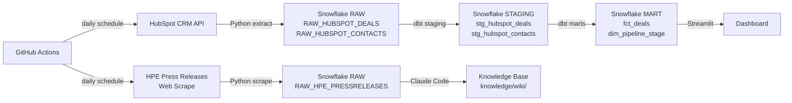

# HPE Sales Operations Analytics

End-to-end sales analytics pipeline built for the Business Analyst, Sales Operations role at Hewlett Packard Enterprise. This project extracts deal pipeline data from the HubSpot CRM API, enriches it with HPE press release data scraped from the web, transforms it into a clean star schema using dbt, and surfaces insights through a deployed Streamlit dashboard. Key findings: mid-funnel deals take 3x longer to close than won deals, and 2 of 8 active deals are currently overdue with no resolution.

## Job Posting

- **Role:** Business Analyst, Sales Operations
- **Company:** Hewlett Packard Enterprise (HPE)
- **Link:** See Docs/job-posting.pdf

This project directly mirrors the HPE Sales Ops role: SQL-based pipeline analysis, automated data pipelines, interactive dashboard development, and deep company research via a queryable knowledge base.

## Tech Stack

| Layer | Tool |
|---|---|
| Source 1 | HubSpot CRM API (deals, contacts) |
| Source 2 | HPE Press Releases (web scrape) |
| Data Warehouse | Snowflake (RAW → STAGING → MART) |
| Transformation | dbt (staging models + star schema) |
| Orchestration | GitHub Actions (daily schedule) |
| Dashboard | Streamlit (deployed to Community Cloud) |
| Knowledge Base | Claude Code (15 sources → 3 wiki pages) |

## Pipeline Diagram



## ERD (Star Schema)

See [Docs/erd.md](Docs/erd.md) for full column definitions.

```
FCT_DEALS                          DIM_PIPELINE_STAGE
-----------                        ------------------
DEAL_ID (PK)                       DEAL_STAGE (PK)
DEAL_NAME                          STAGE_ORDER
DEAL_AMOUNT                        IS_TERMINAL
DEAL_STAGE (FK) -----------------> DEAL_STAGE
PIPELINE
CLOSE_DATE
DEAL_STATUS
DEAL_SIZE_TIER
DAYS_TO_CLOSE
```

## Key Insights

**Descriptive (what happened?):** Mid-funnel deals take 3x longer to close than won deals — appointment-scheduled deals average 65 days vs. 10 days for closed-won deals across a $708,500 active pipeline.

**Diagnostic (why did it happen?):** 2 of 8 active deals are overdue (negative days-to-close) at the presentation and decision-maker stages. Larger deals ($150K avg) close faster because they receive more rep attention and executive sponsorship — smaller mid-funnel deals go dark without a structured follow-up cadence.

**Recommendation:** Implement deal health scoring to flag deals with 0 activity for 14+ days → reduce average days-to-close by 20% through earlier rep re-engagement.

## Live Dashboard

**URL:** https://sales-operations-analyst-tech-7trecnk33sod5z6kdradoc.streamlit.app

## Knowledge Base

A Claude Code-curated wiki built from 15 scraped sources about HPE. Wiki pages live in `knowledge/wiki/`, raw sources in `knowledge/raw/`. Browse `knowledge/index.md` to see all pages.

**Query it:** Open Claude Code in this repo and ask questions like:

- What is HPE's AI strategy and how does the Juniper acquisition fit in?
- What does the HPE sales pipeline look like and where are deals stalling?
- Who are HPE's main competitors and how does HPE differentiate?

Claude Code reads the wiki pages first and falls back to raw sources when needed. See `CLAUDE.md` for the query conventions.

## Setup & Reproduction

**Prerequisites:** Python 3.11+, Snowflake trial account (AWS US East 1), HubSpot developer account with private app token, dbt-snowflake

Copy `.env.example` to `.env` and fill in your credentials:

```
SNOWFLAKE_ACCOUNT=
SNOWFLAKE_USER=
SNOWFLAKE_PASSWORD=
SNOWFLAKE_DATABASE=
SNOWFLAKE_WAREHOUSE=
HUBSPOT_TOKEN=
```

Run the pipeline:

```bash
# Extract from HubSpot and load to Snowflake RAW
python extract/hubspot_extract.py

# Scrape HPE press releases and load to Snowflake RAW
python extract/hpe_scrape.py

# Transform with dbt
python -c "from dbt.cli.main import dbtRunner; dbtRunner().invoke(['run', '--project-dir', 'sales_ops'])"

# Launch dashboard locally
python -m streamlit run dashboard/app.py
```

## Repository Structure

```
.
├── .github/workflows/    # GitHub Actions pipeline (daily schedule)
├── Docs/                 # Job posting, proposal, ERD, slides
├── extract/              # hubspot_extract.py, hpe_scrape.py
├── sales_ops/            # dbt project (staging + mart models)
├── dashboard/            # Streamlit app (app.py)
├── knowledge/            # Knowledge base
│   ├── raw/              # 15 scraped source files
│   ├── wiki/             # Claude Code-generated wiki pages
│   └── index.md          # Wiki index
├── .env.example          # Required environment variables
├── .gitignore
├── CLAUDE.md             # Project context and knowledge base query conventions
└── README.md             # This file
```